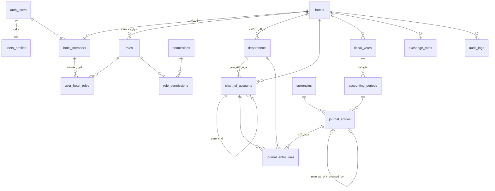

# البنية المعمارية — المرحلة 1 (للمراجعة)

> النطاق: إعداد المشروع + المصادقة والأدوار + دليل الحسابات + دفتر الأستاذ العام (القيد اليدوي) + ميزان المراجعة.
> المطلوب: مراجعة الـ schema وهيكل المجلدات قبل بدء المرحلة 2 (الفوليو والمدفوعات والفواتير).

## 1. طبقات النظام

```
┌──────────────────────────────────────────────────────────────┐
│ الواجهة  src/app  (Server Components + Client Forms)         │  ← عرض فقط
├──────────────────────────────────────────────────────────────┤
│ Server Actions  src/app/**/actions.ts                        │  ← تحقق Zod + صلاحيات UX
├──────────────────────────────────────────────────────────────┤
│ الخدمات  src/services/*.service.ts                           │  ← الوصول للبيانات عبر Supabase
├──────────────────────────────────────────────────────────────┤
│ المنطق المحاسبي  src/lib/accounting  (TypeScript نقي)        │  ← بلا React/Supabase، مغطى بالاختبارات
├──────────────────────────────────────────────────────────────┤
│ PostgreSQL: قيود + تريغرات + RLS + دوال RPC                  │  ← المرجع النهائي للسلامة المحاسبية
└──────────────────────────────────────────────────────────────┘
```

**مبدأ "الدفاع في العمق":** قواعد القيد المزدوج مطبّقة في ثلاث طبقات:
1. `lib/accounting/journal.ts`: تغذية راجعة فورية في النموذج (الفرق، سطور خاطئة).
2. Server Action: يعيد التحقق بنفس المخطط (لا ثقة بالعميل).
3. قاعدة البيانات: تريغر `app.journal_entries_guard` يرفض ترحيل أي قيد غير متوازن **حتى لو جاء الطلب مباشرة عبر PostgREST** متجاوزًا التطبيق.

## 2. مخطط قاعدة البيانات (Schema)



### الجداول

| الجدول | الغرض | ملاحظات أساسية |
|---|---|---|
| `hotels` | المستأجر (يدعم سلاسل الفنادق) | العملة الأساسية، شهر بداية السنة المالية، المنطقة الزمنية. العملة الأساسية مقفلة بعد أول قيد مرحّل |
| `users_profiles` | ملف المستخدم المرتبط بـ `auth.users` | يُنشأ تلقائيًا بتريغر عند التسجيل |
| `permissions` | صلاحيات ثابتة بصيغة `module.resource.action` | 15 صلاحية في المرحلة 1 |
| `roles` | أدوار نظامية (`hotel_id = null`) + أدوار مخصصة لكل فندق | 5 أدوار نظامية: مدير عام، محاسب، مدقق، كاشير، مدير قسم — غير قابلة للتعديل |
| `role_permissions` | ربط الدور بالصلاحيات | |
| `hotel_members` | عضوية المستخدم في الفندق (المستخدم × الفندق + فعّال/معطّل) | مستخدم واحد يمكنه العمل في عدة فنادق |
| `user_hotel_roles` | أدوار المستخدم في الفندق (متعدد لمتعدد) | الصلاحيات = اتحاد صلاحيات كل الأدوار. يشترط العضوية أولًا (FK مركّب). لا يمكن إزالة آخر مدير عام فعّال |
| `departments` | الأقسام = مراكز التكلفة/الإيراد | 11 قسمًا افتراضيًا (غرف، مطعم، سبا، قاعات، متجر، نقل، مغسلة، إدارة...) |
| `currencies` / `exchange_rates` | العملات وأسعار الصرف | 13 عملة مرجعية |
| `chart_of_accounts` | دليل الحسابات الهرمي | نوع + تصنيف فرعي + `normal_balance` مولّد + `is_postable` (تجميعي/تفصيلي) + `system_key` للترحيل الآلي لاحقًا |
| `fiscal_years` / `accounting_periods` | السنوات والفترات | منع التداخل بقيد `EXCLUDE`، الحالة `open/closed` |
| `document_sequences` | ترقيم متسلسل بلا فجوات | `JV-2026-000001` لكل فندق/سنة |
| `journal_entries` | رأس القيد | `draft → posted` فقط، `entry_number` يُمنح عند الترحيل، `source` يحدد مصدر القيد (يدوي/فوليو/فاتورة...) |
| `journal_entry_lines` | سطور القيد | مدين **أو** دائن، `base_debit/base_credit` بالعملة الأساسية |
| `audit_logs` | سجل تدقيق للإضافة فقط | من، متى، ماذا (القيم القديمة/الجديدة والحقول المعدّلة) |

### القواعد المفروضة في قاعدة البيانات

| القاعدة | الآلية |
|---|---|
| القيد متوازن (Σ مدين = Σ دائن > 0) وسطران على الأقل | `app.assert_journal_entry_postable` عند الترحيل |
| السطر إما مدين أو دائن | `CHECK jel_one_side` |
| لا قيد على حساب تجميعي أو غير فعّال أو من فندق آخر | تريغر السطور + FK مركّب `(hotel_id, account_id)` |
| القيد المرحّل لا يُعدّل ولا يُحذف (ولا سطوره) | `app.journal_entries_guard` / `app.journal_lines_guard` — التصحيح بالقيد العكسي فقط |
| الترحيل يتطلب `gl.journal.post` حتى عبر UPDATE مباشر | فحص الصلاحية داخل التريغر |
| لا ترحيل في فترة مقفلة إلا بصلاحية `gl.periods.post_closed` | داخل `assert_journal_entry_postable` |
| الحساب الفرعي بنفس نوع الأب، والأب تجميعي، ولا حلقات | `app.coa_validate_tree` |
| حساب عليه حركات لا يتحول لتجميعي ولا يتغير نوعه | `app.coa_protect_used_account` |
| `created_by` / `posted_by` هو المستخدم الفعلي (لا انتحال) | تريغرات تفرض `auth.uid()` |
| الدور المخصص يُسند فقط داخل فندقه | `app.check_member_role_scope` |
| لا يُزال آخر مدير عام فعّال (حذف دور أو تعطيل/حذف عضوية) | `app.protect_last_general_manager` |
| سجل التدقيق غير قابل للتعديل أو الحذف | `app.audit_logs_immutable` |

### العملات المتعددة ودقة التوازن
- المبالغ بعملة القيد `numeric(19,4)`، وسعر الصرف `numeric(20,10)` على رأس القيد.
- `base_debit = debit × rate` تُخزّن **بلا تقريب** (`numeric` بدون مقياس). بما أن الضرب في ثابت يتوزع على الجمع، فإن توازن القيد بعملته يضمن توازنه بالعملة الأساسية حرفيًا، دون فروقات تقريب. التقريب يتم عند العرض فقط.
- في TypeScript: كل الحسابات عبر `decimal.js` (لا `float` إطلاقًا)، والقيم الرقمية تُقرأ من PostgREST كنصوص (`::text`).

### RLS
- كل الجداول مفعّل عليها RLS. القراءة تتطلب عضوية الفندق + صلاحية الوحدة (`app.has_permission`).
- `app.has_permission` / `app.is_hotel_member` بصلاحية `SECURITY DEFINER` لتفادي التكرار اللانهائي في سياسات `hotel_members` و`user_hotel_roles`.
- `document_sequences` بلا أي سياسة: لا وصول إلا عبر دالة النظام.
- الدوال المساعدة في مخطط `app` غير المكشوف عبر الـ API.

### واجهات RPC
| الدالة | الوصف |
|---|---|
| `create_hotel(...)` | إنشاء فندق + عضوية المُنشئ كمدير عام + أقسام ودليل حسابات افتراضي + سنة مالية بـ12 فترة |
| `create_fiscal_year(hotel, start_date)` | سنة مالية بفترات شهرية |
| `save_journal_entry(...)` | إنشاء/تحديث مسودة مع سطورها ذرّيًا، مع ترحيل اختياري |
| `post_journal_entry(id)` | ترحيل مسودة |
| `reverse_journal_entry(id, date)` | قيد عكسي مرحّل مربوط بالأصلي |
| `gl_account_activity(hotel, fy_start, from, to)` | حركة الحسابات لميزان المراجعة |
| `my_permissions(hotel)` | صلاحيات المستخدم الحالي (لإظهار/إخفاء عناصر الواجهة) |

## 3. هيكل المجلدات

```
├── docs/ARCHITECTURE.md             ← هذا الملف
├── supabase/
│   ├── migrations/                  ← ترحيلات SQL مرقّمة (تُطبق بـ supabase db push)
│   │   ├── …0001_core_tenancy_and_auth.sql   الفنادق، المستخدمون، الأدوار، الصلاحيات، الأقسام، العملات
│   │   ├── …0002_chart_of_accounts.sql       دليل الحسابات + القالب الفندقي الافتراضي
│   │   ├── …0003_periods_and_general_ledger.sql  الفترات، القيود، الترحيل، العكس، RPC
│   │   ├── …0004_audit_log.sql               سجل التدقيق
│   │   └── …0005_rls_policies.sql            سياسات RLS والصلاحيات على الدوال
│   └── tests/                       ← اختبارات SQL على PostgreSQL محلي (npm run test:db)
├── src/
│   ├── proxy.ts                     ← (middleware في Next 16) تحديث الجلسة وحماية المسارات
│   ├── app/
│   │   ├── login/ , onboarding/     ← المصادقة وإعداد الفندق
│   │   └── (app)/                   ← المسارات المحمية مع الشريط الجانبي
│   │       ├── page.tsx             لوحة التحكم
│   │       ├── accounts/            دليل الحسابات (شجرة + نموذج)
│   │       ├── journal/             القيود: قائمة، جديد، عرض، تعديل مسودة، ترحيل، عكس
│   │       └── reports/trial-balance/
│   ├── components/ui/               ← مكونات بأسلوب shadcn/ui
│   ├── components/layout/           ← الشريط الجانبي، مبدّل اللغة
│   ├── i18n/                        ← القواميس (ar مرجعي، en مطابق بفحص TypeScript)، RTL
│   ├── lib/
│   │   ├── accounting/              ← ★ المنطق المحاسبي النقي + اختبارات الوحدة
│   │   │   ├── money.ts             مبالغ عشرية دقيقة (decimal.js)
│   │   │   ├── journal.ts           التحقق من القيد المزدوج، العملة الأساسية، القيد العكسي
│   │   │   ├── accounts.ts          شجرة الحسابات والطبيعة وقواعد الوضع
│   │   │   ├── trial-balance.ts     ميزان المراجعة + إقفال أرباح السنوات السابقة
│   │   │   ├── fiscal.ts            السنة المالية وتاريخ الفندق
│   │   │   └── errors.ts            تحويل أخطاء DB إلى مفاتيح ترجمة
│   │   ├── validation/              ← مخططات Zod (تستخدم lib/accounting)
│   │   ├── auth/                    ← سياق المستخدم/الفندق/الصلاحيات
│   │   └── supabase/                ← عملاء الخادم/المتصفح + أنواع قاعدة البيانات
│   └── services/                    ← طبقة الوصول للبيانات
```

## 4. القرارات المعتمدة

1. **ترقيم القيود عند الترحيل** (وليس عند الإنشاء): تسلسل بلا فجوات للقيود المرحّلة، والمسودات بلا رقم رسمي. ✅
2. **المسودات يمكن حفظها غير متوازنة**؛ التوازن شرط للترحيل فقط. ✅
3. **أدوار متعددة لكل مستخدم في كل فندق** عبر `user_hotel_roles`؛ الصلاحيات = اتحاد صلاحيات الأدوار. ✅
4. **ميزان المراجعة يُقفل أرباح السنوات السابقة في الأرباح المبقاة تلقائيًا في العرض** حتى قبل قيد الإقفال الفعلي (المرحلة 6). ✅

ملاحظات تصميمية للمراحل القادمة:
- **سير عمل الموافقات** (المرحلة 6) سيضيف حالة `pending_approval` بين `draft` و`posted` — التصميم الحالي يسمح بذلك دون كسر.
- **الترحيل الآلي** (فوليو، فواتير، مدفوعات) سيعتمد على `chart_of_accounts.system_key` + `journal_entries.source/source_id`، فلا تُكتب أرقام حسابات ثابتة في الكود.

## 5. ما لم يُنفّذ عمدًا في المرحلة 1
- واجهة إدارة المستخدمين/الأدوار والأقسام وأسعار الصرف (الجداول وRLS جاهزة، الواجهة لاحقًا).
- واجهة إقفال الفترات (الدالة والتريغر جاهزان ومختبران؛ الواجهة في المرحلة 6).
- الضرائب، التصدير PDF/Excel، الرسوم البيانية ومؤشرات ADR/RevPAR (المراحل 5–6).


---

# المرحلة 2: الإيرادات والفوليو والفواتير والمدفوعات

## الجداول الجديدة

| الجدول | الغرض |
|---|---|
| `tax_rates` | ضرائب قابلة للتهيئة: النوع، النسبة، بسيطة/مركّبة، وحساب الالتزام. **لا ضرائب مفترضة** — تُضاف من الإعدادات |
| `charge_codes` + `charge_code_taxes` | رموز الإيراد لكل الأقسام (غرف، مطعم، ميني بار، سبا، قاعات، نقل، غسيل، مواقف...) مع القسم وحساب الإيراد والضرائب والسعر الشامل/غير الشامل |
| `payment_methods` | طرق الدفع وحساباتها: نقد، بطاقة (قيد التحصيل)، تحويل، شيك، محفظة، **آجل (City Ledger → ذمم مدينة)** |
| `customers` | الأفراد والشركات والوكالات ومنصات الحجز: الرقم الضريبي، السماح بالآجل، الحد الائتماني، مدة السداد |
| `guest_folios` | الفوليو: نزيل، رئيسي لمجموعة، شركة، غير نزيل. رقم متسلسل `F-2026-000001` |
| `folio_transactions` + `folio_transaction_taxes` | حركات الفوليو (للإضافة فقط): رسم، خصم، دفعة، استرداد، عربون، تطبيق عربون، رد عربون، تحويل صادر/وارد، مع `ledger_effect` / `deposit_effect` مولّدة |
| `invoices` + `invoice_items` + `invoice_taxes` | الفاتورة الضريبية (فوليو أو مباشرة آجلة) `INV-2026-000001` — لا تُعدّل بعد الإصدار |
| `payments` + `payment_allocations` | سندات القبض `RV-` والصرف `PV-`، وتخصيص القبض على الفواتير |

## القرار المحاسبي الأهم: الاعتراف بالإيراد عند تقديم الخدمة

كل رسم على الفوليو يُرحّل قيده **فور تسجيله** (مدين ذمم النزلاء / دائن الإيراد بمركز تكلفة القسم / دائن كل ضريبة)، وليس عند المغادرة.
السبب: نزيل مقيم من 28 إلى 3 من الشهر التالي يجب أن تظهر لياليه في شهرها (أساس الاستحقاق). عند المغادرة: يُطبّق العربون، يُشترط رصيد صفري، تصدر الفاتورة، ويُغلق الفوليو.

| الحركة | مدين | دائن |
|---|---|---|
| رسم | ذمم النزلاء | الإيراد (بالقسم) + الضرائب |
| خصم | خصومات مسموح بها (بالقسم) + عكس الضرائب | ذمم النزلاء |
| دفعة | حساب طريقة الدفع | ذمم النزلاء |
| تحويل للآجل | ذمم مدينة - شركات | ذمم النزلاء |
| عربون | حساب طريقة الدفع | ودائع النزلاء |
| تطبيق العربون | ودائع النزلاء | ذمم النزلاء |
| استرداد / رد عربون | ذمم النزلاء / ودائع النزلاء | حساب طريقة الدفع |
| فاتورة مباشرة | ذمم مدينة - شركات | الإيراد + الضرائب |
| سند قبض من عميل | حساب طريقة الدفع | ذمم مدينة - شركات |
| سند صرف لحساب | الحساب (مصروف...) بمركز تكلفة | حساب طريقة الدفع |

## محرك الترحيل الآلي

- المستندات تنشئ قيودها عبر `app.post_system_entry` (مصدر `folio`/`invoice`/`payment` + `source_id`). علَم "ترحيل نظامي" على مستوى المعاملة يسمح للكاشير بالترحيل دون صلاحية القيد اليدوي، **مع بقاء كل قواعد القيد المزدوج مفروضة** (التوازن، الحسابات التفصيلية، الفترات المقفلة).
- المستخدم لا يستطيع إنشاء قيد يدوي بمصدر آلي، ولا عكس قيد آلي يدويًا: التصحيح من المستند (إلغاء حركة الفوليو أو السند) حتى يبقى الدفتر الفرعي مطابقًا للأستاذ.
- الإلغاء (void) لا يحذف ولا يعدّل: ينشئ حركة معاكسة ويعكس قيدها.

## الضرائب

خوارزمية واحدة في مكانين متطابقين ومختبرين بنفس الأمثلة: `src/lib/accounting/tax.ts` (معاينة فورية في الواجهة) و`app.compute_taxes` (المرجع عند الترحيل).
بسيطة على الصافي، مركّبة على (الصافي + البسيطة)، والسعر الشامل يُستخرج منه الصافي مع ضبط فرق التقريب ليطابق المبلغ المدخل حرفيًا.

## ثوابت محاسبية مختبرة (supabase/tests/02_revenue.test.sql)

- رصيد **ذمم النزلاء** في الأستاذ = مجموع أرصدة كل الفوليوهات.
- رصيد **ودائع النزلاء** في الأستاذ = مجموع عربون الفوليوهات.
- رصيد **الذمم المدينة** في الأستاذ = المتبقي على الفواتير − الرصيد الدائن غير المخصص للعملاء.
- الأستاذ متوازن بعد كل السيناريوهات.

## الصلاحيات الجديدة

`folio.view/manage/allowance/void/checkout`، `invoices.view/create`، `payments.view/receipt/disbursement/void`، `customers.view/manage`، `settings.revenue.manage`.
الكاشير: فتح الفوليو، الرسوم والمدفوعات، المغادرة، سندات القبض — **بدون** خصومات أو إلغاء أو سندات صرف.

## مؤجّل عمدًا

- **المطابقة البنكية** → المرحلة 3 (مع الموردين والذمم الدائنة).
- **إشعار دائن** لتصحيح فاتورة بعد إصدارها → المرحلة 3.
- **ترحيل الغرف الليلي الآلي (Night Audit)** وتكامل POS → لاحقًا؛ حاليًا يُسجّل رسم الغرفة بعدد الليالي.
- **عملات أجنبية في الفوليو** → الفوليو بالعملة الأساسية حاليًا.
- **PDF** للفاتورة → المرحلة 5 (الآن صفحة قابلة للطباعة).


---

# المرحلة 3: الذمم الدائنة والمصروفات والبنك

| المستند | القيد الآلي |
|---|---|
| أمر شراء `PO-` | لا قيد (مستند التزام) — يتحول لفاتورة مورد |
| فاتورة مورد `VB-` | مدين المصروف/المخزون/الأصل (بمركز تكلفة) + ضريبة المدخلات (للضرائب من نوع vat) / دائن ذمم دائنة |
| سداد مورد `PV-` | مدين ذمم دائنة / دائن البنك أو الصندوق، مع تخصيص على الفواتير |
| مسيّر رواتب `PR-` | مدين الرواتب + البدلات + تأمينات المنشأة (بالقسم) / دائن رواتب مستحقة (الصافي) + مصروفات مستحقة (التأمينات) + الرواتب (الخصومات) |
| صرف الرواتب | سند صرف على حساب "رواتب مستحقة" |
| العهدة النثرية | طريقة دفع PETTY على حساب العهدة؛ التعزيز بسند صرف من البنك إلى حساب العهدة |
| إشعار دائن `CN-` | مدين خصومات مسموح بها + عكس الضرائب بالنسبة / دائن ذمم مدينة — يخفّض مستحق الفاتورة |

- **المطابقة البنكية:** حركات الكشف تُدخل يدويًا وتُطابق مع سطور الأستاذ المرحّلة على نفس الحساب وبنفس المبلغ (تلقائيًا ضمن ±7 أيام أو يدويًا).
- **أعمار الذمم:** `aging_report` للمدينة والدائنة بالشرائح (حالي، 1-30، 31-60، 61-90، +90) من تاريخ الاستحقاق.
- **سرية الرواتب:** لا يراها إلا من يملك `payroll.manage` (الكاشير والمدقق لا يرونها).
- **ثابت مختبر:** الذمم الدائنة في الأستاذ = المتبقي على فواتير الموردين.
- **مؤجّل:** استيراد كشف البنك من ملف CSV، دفعات مقدمة للموردين، ربط المشتريات بكميات المخزون (المرحلة 4).
